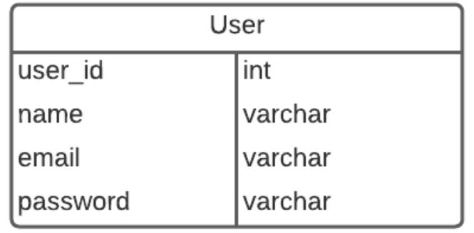
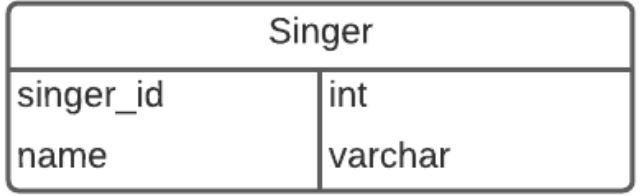
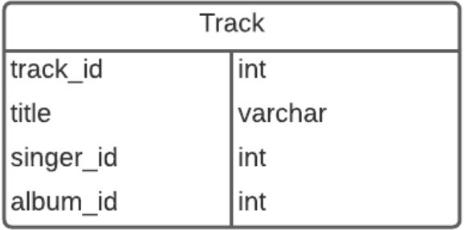
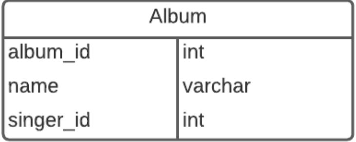
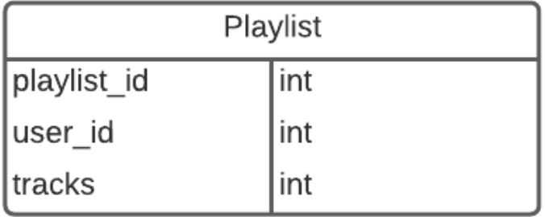
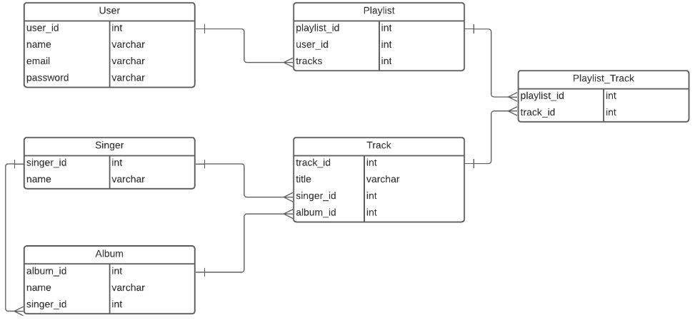

# Writing Test Week-6

## Web Server & RESTful API

**Apa itu Web Server**
- Web server terdiri dari 2 komponen penting:
  - Hardware
  - Software

- Dari sisi harware, web server adalah sebuah komputer yang menyimpan *web server sofware* dan *komponen file sebuah website*.
- Pada software, server web mencakup beberapa bagian yang mengontrol bagaimana pengguna web mengakses file yang dihosting. Minimal, ini adalah server HTTP. Server HTTP adalah perangkat lunak yang memahami URL (alamat web) dan HTTP (protokol yang digunakan browser Anda untuk melihat halaman web). Server HTTP dapat diakses melalui nama domain situs web yang disimpannya, dan mengirimkan konten situs web yang dihosting ini ke perangkat pengguna akhir.
- Static web server, atau stack, terdiri dari komputer (Hardware) dengan server HTTP (Software). Kami menyebutnya "statis" karena server mengirimkan file yang dihosting apa adanya ke browser.
- Sebuah Dynamic Server Web terdiri dari server web statis yang ditambah perangkat lunak tambahan, seperti server aplikasi dan database. Disebut dinamis karena server aplikasi memperbarui file yang dihosting sebelum mengirim konten ke browser melalui server HTTP.
- Server Side Programming, atau Bahasa Pemrograman sisi server, adalah bahasa pemrograman web, yang letak source code nya nanti hanya ada di webserver. Bahasa ini source code nya tidak akan muncul di sisi client. Pada dasarnya server side programming ini memiliki arti yang sama dengan backend scripting.
- Static Website atau Website statis adalah sebuah website yang kontennya statis / tidak berubah-ubah. Sekali dibuat dan online di Internet, pada umumnya website tersebut tidak dapat diubah kecuali diubah secara manual melalui pengubahan bahasa pemograman website tersebut.
- Website Dinamis atau Dynamic Website adalah jenis halaman web yang disusun oleh konten dan layout yang memiliki banyak informasi didalamnya. Diberi nama website Dinamis karena kontennya dapat berubah-ubah. Dengan kata lain, adanya program yang berjalan untuk mengatur perubahan data yang ditampilkan dalam website Dinamis tersebut.
- Perbedaan antara Website Statis dan Website Dinamis :

1. Memiliki tujuan dan Concern yang berbeda.
2. Biasanya menggunakan bahasa pemrograman yang berbeda (kecuali Javascript).
3. Berjalan pada lingkungan sistem operasi yang berbeda.

- REST memiliki kepanjangan dari REpresentational State Transfer yaitu gaya arsitektur untuk menyediakan standart antara sistem komputer pada web, sehingga memudahkan sistem untuk berkomunikasi satu sama lain. Implementasi klien dan server dapat dilakukan secara mandiri tanpa harus tahu satu sama lain.
- Di dalam REST, implementasi klien dan implementasi server dapat dilakukan secara independen tanpa saling mengetahui satu sama lain, ini berarti bahwa kode di sisi klien dapat diubah setiap saat tanpa mempengaruhi operasi server, dan kode di sisi server dapat diubah tanpa mempengaruhi operasi klien.
- Dengan menggunakan REST, klien yang berbeda dapat mencapai titik akhir REST yang sama, melakukan tindakan yang sama, dan menerima respons yang sama, klien dapat berupa platform web, platform seluler, atau platform desktop.
- *Membuat sebuah Request* : REST mengharuskan klien membuat permintaan / Request ke server untuk mengambil atau mengubah data di server. Permintaan biasanya terdiri dari :

1. Sebuah HTTP verb, yang mendefinisikan jenis operasi apa yang harus dilakukan.
2. Sebuah header, yang memungkinkan klien untuk menyampaikan informasi tentang Request.
3. Sebuah jalan menuju Resource.
4. Suatu pesan opsional yang berisi data.

- *HTTP Verbs* : Terdapat 4 HTTP Verb dasar yang biasa digunakan dalam Request untuk berinteraksi dengan sumber daya dalam sistem REST :

1. GET : untuk mengambil atau membaca data.
2. POST : untuk membuat (create) item/resource baru.
3. PUT : untuk mengupdate item/resource yang telah ada.
4. DELETE : untuk menghapus item/resource yang telah ada.

- Pada header Request, klien mengirimkan jenis konten yang dapat diterima dari server. Biasa disebut Accept Field, sertamemastikan bahwa server tidak mengirim data yang tidak dapat dipahami atau diproses oleh klien. Opsi untuk jenis konten adalah Jenis MIME (atau Ekstensi Surat Internet Serbaguna)
- Tipe lain yang biasanya digunakan :

1. image : image/png, image/jpeg, image/gif.
2. audio : audio/wav, audio/mpeg
3. video : video/mp4, video/ogg
4. application : application/json, application/pdf, application/xml, application/octet-stream
- Accept Header Field dalam hal ini menunjukkan bahwa klien akan menerima konten dalam teks/html atau aplikasi/xhtml.
- Sebuah Request harus berisi jalur (path) ke sumber daya tempat operasi harus dilakukan. Pada RESTful API, jalur (path) harus dirancang untuk membantu klien mengetahui apa yang sedang terjadi.
- Sebuah jalur (path) seperti **nike.com/customers/2/orders/20** jelas apa yang ingin dipilih / ditunjuk. Path ini bersifat hierarkis dan deskriptif. *Kita dapat melihat bahwa kita mengakses pesanan dengan id 20 untuk pelanggan dengan id 2.*
- Content Types atau Tipe Konten : Ketika klien mengakses sumber daya dengan id 23 di sumber artikel dengan Request GET 
- Response Code : Untuk setiap HTTP Verbs, ada kode status yang akan dikembalikan server setelah berhasil

1. GET : Mengembalikan 200 (OK).
2. POST : Mengembalikan 201 (CREATED).
3. PUT : Mengembalikan200 (OK).
4. DELETE : Mengembalikan 204 (NO CONTENT).

## Intro Node.Js
- Node.js adalah software open-source yang bisa digunakan untuk membuat aplikasi jaringan dan aplikasi server-side yang real-time dan scalable (bisa dikembangkan sesuai kebutuhan). Pada dasarnya, Node.js adalah runtime environment lintas platform single-thread yang dibangun berdasarkan engine JavaScript V8 Chrome.
- Node JS memiliki konsep yang berbeda dengan javascript.
- Thread dalam ilmu komputer adalah eksekusi menjalankan beberapa tugas atau program secara bersamaan. Setiap unit yang mampu mengeksekusi kode disebut thread. Javascript menggunakan konsep single thread, yang berarti hanya memiliki satu tumpukan panggilan yang digunakan untuk menjalankan program.
- Javascript menggunakan call stack untuk melakukan manajemen single thread. Ketika terdapat perintah baru maka akan ditambahkan (push) dan akan di keluarkan ketika perintahnya sudah selasai (pop).
- Terdapat event queue yang berguna sebagai penampung ketika terdapat perintah baru yang akan dieksekusi yaitu Event loop. Event loop akan memfasilitasi kondisi ini, event loop akan memeriksa terus menerus, ketika antrian kosong di call stack maka akan menambah antrian baru dari event queue sampai semua perintah selesai di eksekusi.
- Javascript merupakan bahasa pemrograman yang digunakan di front end side. Sehingga kita hanya bisa mengerjakan javascript dengan menggunakan browser untuk menampilkan hasil eksekusinya. Tetapi dengan menggunakan NodeJS kita dapat menjalankan javascript di server side menggunakan terminal command line menggunakan perintah “node”.
- Untuk mengetes apakah berhasil terinstall, dapat menjalankan “node -v” untuk mengecek versi NodeJS yang terinstal.
- Console merupakan module bawaan dari javascript yang ada di node JS untuk digunakan sebagai debug atau menampilkan code secara interface.
- Process adalah modules yang digunakan untuk menampilkan dan mengontrol prosess Node JS yang sedang dijalankan.
- OS module merupakan module yang digunakan untuk menyediakan informasi terkait sistem operasi komputer yang digunakan user.
- Modul Util merupakan alat bantu / utilities untuk mendukung kebutuhan internal API di Node JS
- Errors merupakan modul yang dapat digunakan untuk mendefinisikan error di Node JS sehingga lebih informatif. Kita juga dapat menghandle error menggunakan try catch
- Buffer merupakan modules yang digunakan untuk mengakses, mengelola dan mengubah tipe data raw atau tipe data bytes
- Fs atau “file system” merupakan module yang dapat membantu berinteraksi dengan file yang ada diluar code. FS paling sering digunakan untuk membaca file dengan ekstensi .txt, .csv, dan .json
- Timers merupakan modules yang digunakan untuk melakukan scheduling atau mengatur waktu pemanggilan fungsi yang dapat diatur di waktu tertentu
- Node.js memiliki built-in modul yang disebut HTTP, built-in modul ini memungkinkan Node JS mentransfer data melalui Hyper Text Transfer Protocol (HTTP).
- Modul HTTP dapat membuat server HTTP yang mendengarkan port server dan memberikan respons kembali kepada klien.
- *require()* : Ketika akan menggunakan modul HTTP
- *createServer()* : Ketika akan membuat server HTTP
- Callback function yang digunakan pada method http.createServer(), akan dijalankan ketika seseorang mencoba mengakses komputer pada port 8080.
- res.writeHead() : ketika akan menambahkan header HTTP. Argumen pertamanya yaitu status code. Jika 200 berarti ok / berhasil, lalu argumen kedua adalah objek yang memiliki header respon
- Respons yang dikembalikan dari HTTP web server bisa dalam berbagai format, seperti JSON, HTML, XML, dan CSV
- Callback function pada method http.createServer() memiliki argumen req yang mewakili request dari klien, sebagai objek (objek http.IncomingMessage).
- Objek ini memiliki sebuah properti yang disebut "url" yang menyimpan informasi url yang sedang mengakses.
- Build-in module yang bisa kita gunakan untuk split query string menjadi beberapa bagian yang dapat dibaca yaitu URL Module

## Express JS

**Apa itu Express JS**
- Express.js atau simpelnya Express merupakan back end web application framework untuk Node.js yang merupakan software free dan open-source dibawah MIT License.
- Express didesain untuk membuat aplikasi web dan API.
- Express mempunyai kelebihan yaitu terletak pada fitur caching, mendukung Google V8 Engine, JavaScript, serta didukung oleh komunitas dan skalabilitas aplikasi yang baik.

**Apa itu Back End Web Application**
- Back end application adalah aplikasi yang berjalan di *server-side* yang bekerja untuk memberikan informasi berupa data sesuai request dari client/browser/front end app.

**Instalation and Preparation**
- Install Express JS
  Kita dapat menggunakan NPM untuk menginstall Express JS
  
- Preparation
  Terdapat beberapa module yang perlu diinstall untuk mempermudah develop server side application, seperti nodemon yang berguna untuk restart aplikasi secara otomatis selama proses development.

**Basic Syntax Express JS**
```JS
const express = require("express");
const app = express();
const PORT = 8080;

app.get('/', (req, res) => {
  res.send("Hello World!");
})

app.listen(PORT, () => {
  console.log("Contoh app listening pada http://localhost:$(PORT)");
})
```

**Basic Routes**
- Routes adalah sebuah end point yang dapat kita akses menggunakan URL di website.
- Di dalam routes kita perlu menentukan method API, alamat dan response apa saja yang akan dikeluarkan.
- Untuk menjalankan aplikasi sederhana kita dapat menggunakan "node" pada terminal. Kemudian kita dapat mengaksesnya di website dan menambah route yang akan kita akses yaitu "/".

**Method**
- Kita dapat menggunakan method dalam REST APi seperti post, put, patch, dan delete.

**Response**
- Kita dapat mengirim response menggunakan parameter dari route express.js yaitu *res.Send()* untuk mengirim plain text ketika kita mengakses route tersebut.
- Kita dapat mengirim response berupa output JSON yang biasa digunakan untuk back end application. Dengan menggunakan JSON maka kita dapat mengirim data yang mudah diakses.

**Status Code**
- Dalam implementasi back end application, kita sangat perlu memberikan status code sebagai informasi apakah route yang kita akses berjalan sebagaimana mestinya dan tidak terjadi eror.

**Query**
- Query merupakan parameter yang digunakan untuk membantu menentukan tindakan yang lebih spesifik daripada hanya sekedar router biasa. Pada umumnya, Query ditaruh di akhir route dengan memberikan informasi diawali dengan "?" kemudian terdapat key dan data yang dapat ditindak lanjuti.
  Contoh: "?q=hello&age=23"
- Pada Express JS, kita juga dapat membaca query menggunakan req.query, kemudian informasi tersebut dapat kita olah atau kita kembalikan lagi


**Nested Route**
- Nested route digunakan ketika terdapat banyak route yang memiliki nama yang sama atau ingin membuat route yang lebih mendalam

**Express Middleware**
- Middleware function adalah sebuah fungsi yang memiliki akses ke object request (req), object response (res), dan sebuah fungsi next didalam request-response cycle.
- Fungsi next biasanya diberikan nama variabel next.
- Jika pada tahap manapun middleware function menentukan bahwa suatu HTTP Request adalah request yang buruh dan salah, maka middleware function meiliki kemampuan untuk menghentikan request-response cycle.
- Berlaku sebaliknya, jika middleware function menentukan suatu HTTP Request baik dan benar, maka middleware function memiliki kemampuan untuk melanjutkan request-response cycle ke proses selanjutnya.

- Pada dasarnya, sebuah middleware function dapat melakukan tugas-tugas berikut:
  - Menjalankan kode apapun.
  - Memodifikasi Object Request dan Object Response.
  - Menghentikan request-response cycle.
  - Melanjutkan ke middleware function selanjutnya atau ke handler function dalam suatu request response cycle.

- Express mideleware dapat dikelompokkan berdasarkan dimana middleware function itu digunakan:
  - Application Level Middleware
  - Router Lever Middleware
  - Eror Handling Middleware

**Apllication Level Middleware** adalah sebuah fungsi middleware yang melekat ke instance object Application Express
- Penggunaannya dengan cara memanggil method app.use().

**Router Level Middleware** adalah sebuah fungsi middleware yang cara kerjanya sama persis dengan application level middleware, yang menjadikan perbedaan adalah middleware function ini melekat ke instance object Router Express
- Penggunaannya dengan cara memanggil method express.Router().

**Error Handling Middleware** mengacu kepada bagaimana sebuah Express Application mengangkap dan memproses error yang terjadi, baik itu berupa kesalahan yang synchrounous maupun asynchronous.
- *Error handling middleware* digunakan pada *application level middleware*.
- Error handling middleware function harus memberikan 4 argument yaitu (err, req, res, next) agar bisa dideteksi oleh Express Application sebagai *Error Handling Middleware*. Jika hal ini tidak dilakukan, maka Express Application tidak akan mengenali middleware function ini sebagi *Error Handling Middleware* dan akan menganggap middleware ini sebagai *Application Level Middleware* biasa.

**express.static()**
- Fungsi middleware ini memungkinkan sebuah express application melayani asset statis berupa file, seperti file HTML, gambar, video, dokumen, dan sebagainya.

**express.json()**
- Fungsi middleware ini memungkinkan sebuah express application menerima HTTP Request yang membawa payload (data) dalam format JSON.

**express.urlEncode()**
- Fungsi middleware ini memungkinkan sebuah express application menerima HTTP Request yang membawa payload (data) dalam format urlencoded.

## Design Database with MySQL
**Menentukan Entitas**
- Kita dapat menentukan entiti seperti berikut:

- User
- Singer
- Track
- Album
- Playlist

**Entitas User**


Entitas Singer


Entitas Track


Entitas Album


Entitas Playlist


**Menentukan Relasi antar Entitas**
- Relasi Entitas secara keseluruhan


- Relasi Entitas Singer dan Entitas Track
  1 singer punya 1 atau lebih track, maka relasinya adalah one to many

- Relasi Entitas Album dan Entitas Track
  1 album punya 1 atau lebih track, maka relasinya adalah one to many

- Relasi Entitas User dan Entitas Playlist
  1 user punya 0 atau lebih playlist, maka relasinya adalah zero or more to many

- Relasi Entitas Playlist dan Entitas Track
  1 playlist punya 1 atau lebih track.
  1 track bisa ada di banyak playlist.
  Maka relasinya adalah many to many
  Untuk relasi many to many, dibutuhkan entitas tambahan sebagai penghubung. Dalam kasus ini yaitu entitas **Player_Track**